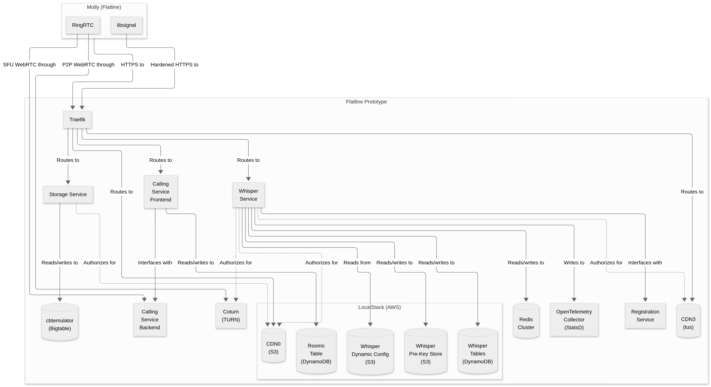

# Flatline Prototype Architecture

This document describes the current architecture of the Flatline prototype in order to show the relationship between each of the main Flatline components and to explain their individual function. Additionally, this document discusses the choices regarding which components from the original Signal implementation were excluded from the Flatline prototype.

Although this architecture description is based in the [Kubernetes](https://kubernetes.io/)-based installation provided for Flatline, it only references components that are specific to Flatline and does not attempt to detail how they are deployed in Kubernetes.

Some design decisions for the prototype were influenced by the choice to primarily target deploying on a single-node [k3s](https://k3s.io/) cluster.

## Diagram

## Components

- [Client](#client)
  - [Molly](#molly)
  - [libsignal](#libsignal)
- [Core](#core)
  - [Whisper Service](#whisper-service)
  - [Storage Service](#storage-service)
  - [Registration Service](#registration-service)
- [Infrastructure](#infrastructure)
  - [Traefik](#traefik)
  - [LocalStack](#localstack)
    - [Whisper Database](#whisper-database)
    - [Whisper Dynamic Configuration](#whisper-dynamic-configuration)
    - [Whisper Pre-Key Store](#whisper-pre-key-store)
    - [CDN0](#cdn0)
  - [CDN3](#cdn3)
  - [cbtemulator](#cbtemulator)
  - [Redis Cluster](#redis-cluster)
  - [OpenTelemetry Collector](#opentelemetry-collector)

### Client

#### Molly

The [Molly](https://molly.im/) client. The version of Molly used with Flatline has been modified to reference Flatline endpoints and to use a modified version of the fork of [libsignal](#libsignal) used by Molly. Although most communication with Flatline happens in the Molly application itself (JVM), some interactions are handled directly by [libsignal](#libsignal) (Rust), which Molly uses as a dependency.

#### libsignal

A [fork](https://github.com/mollyim/libsignal) of the original [libsignal](https://github.com/signalapp/libsignal/) library, built in Rust but with bindings for Java, Node and Swift. For the Flatline prototype, the development environment has been modified to pin the Flatline development certificate and loopback network address to communicate with the [Whisper service](#whisper-service). Communication with other components excluded from the Flatline prototype like [Secure Value Recovery](#secure-value-recovery), the [Contact Discovery Service](#contact-discovery-service) or the [Key Transparency Server](#key-transparency-server--auditor) has been disabled for the development environment.

### Core

#### Whisper Service

The main component of Flatline. Clients communicate with it directly over HTTPS or WebSocket requests. It exposes most of the backend APIs (e.g. accounts, devices, keys, profiles, messages...) used by clients and also provides clients with the necessary credentials to directly upload files to the [CDN0](#cdn0) and [CDN3](#cdn3) components.

It expects to communicate with the propietary AWS DynamoDB and AWS S3 services, which in the Flatline prototype are emulated by [LocalStack](#localstack). Whisper relies on DynamoDB to host [several tables](#whisper-database) used to keep most of its persistent state. It also relies on S3 to manage [device pre-keys](#whisper-pre-key-store) and fetch [dynamic configuration](#whisper-dynamic-configuration) parameters.

For various caches and queues, Whisper reslies on a [Redis cluster](#redis-cluster). During the client registration process, Whisper communicates with the [registration service](#registration-service). In Flatline, Whisper is configured to send telemetry to the [OpenTelemetry Collector](#opentelemetry-collector) component, which replaces the propietary Datadog Agent.

#### Storage Service

The component that manages groups, including their membership and metadata. Clients communicate with it directly. It stores and retrieves its data from a Bigtable database, which in the Flatline prototype is emulated by the [cbtemulator](#cbtemulator) component. It also provides clients with the necessary credentials to upload group avatars to the S3-based [CDN0](#cdn0) component.

#### Registration Service

The component that verifies phone numbers by sending a verification code via SMS or phone call. In the Flatline prototype, this component runs in development mode and does not actually send any codes. Its function in the prototype is mainly to act as a placeholder that [Whisper](#whisper-service) can interact with during registration and will accept any code that matches the last six digits of the registering phone number.

In the future, it will be replaced by a service that registers users based on something other than a phone number.

### Infrastructure

#### Traefik

In the Flatline prototype, Traefik acts as the reverse proxy, terminating TLS connections from clients and routing them to the appropriate components based on the request hostname. It also uses a middleware to add the appropriate [path-style prefix](https://docs.aws.amazon.com/AmazonS3/latest/userguide/VirtualHosting.html#virtual-hosted-style-access) to requests directed to the [CDN0](#cdn0) S3 bucket hosted in [LocalStack](#localstack). It uses a single wildcard certificate which is pinned in various clients.

Traefik was used for this purpose due to the fact that it is bundled with [k3s](https://k3s.io/).

#### LocalStack

In the Flatline prototype, [LocalStack](https://github.com/localstack/localstack) is used to emulate various [AWS](https://docs.aws.amazon.com/) resources that components and clients originally depended on.

The required AWS resources are created during the initialization of LocalStack [via CloudFormation](../charts/flatline/files/localstack/whisper-service-aws-cloudformation.yaml). After the creation of those resources, the necessary S3 objects will be [uploaded](../charts/flatline/files/localstack/whisper-service-init.sh) using the `awslocal` tool.

##### Whisper Database

This element is a DynamoDB database which stores most information related to [Whisper](#whisper-service), including accounts, profiles, messages and various public keys. The key schema, attribute definitions and indexes from each table in this database are inferred from the relevant storage class in the Whisper source code and configured [via CloudFormation](../charts/flatline/files/localstack/whisper-service-aws-cloudformation.yaml).

##### Whisper Dynamic Configuration

This element is an S3 bucket which stores a single YAML configuration file. This configuration file is periodically retrieved by [Whisper](#whisper-service) to update some configuration attributes in runtime. These attributes relate to captchas, limits, client deprecation and experiments, among others.

##### Whisper Pre-Key Store

This element is an S3 bucket where [Whisper](#whisper-service) stores device pre-keys that are referenced in DynamoDB. These keys are uploaded by [Whisper](#whisper-service) on behalf of clients and requested by other clients who wish to initiate communication with a given account or phone number identity.

##### CDN0

This element is an S3 bucket where clients upload avatar images to and download avatar images from. This bucket is used for both individual and group profiles. To this end, both the [Whisper](#whisper-service) and [storage](#storage-service) services are configured to issue temporary STS (Security Token Service) credentials for that specific bucket to clients that request an avatar upload form.

#### CDN3

The component that handles the upload of attachments and any other media (images, video, audio, documents, stories...) other than avatar images. In the Flatline prototype, the experimental CDN3 feature has been made the default CDN for attachments over the previous CDN2, which relies on the GCS (Google Cloud Storage) service.

In the Flatline prototype, the CDN3 component consists on a [tusd](https://github.com/tus/tusd) server with a [custom `pre-create` hook](../charts/flatline/files/tus/pre-create) that emulates the file naming behavior of the [original implementation](https://github.com/signalapp/tus-server) based on Cloudflare workers and R2. Unlike the original implementation where downloads are made directly from R2, the tus server used in Flatline acts both as the upload and download endpoint for clients.

#### cbtemulator

In the Flatline prototype, [cbtemulator](https://github.com/fullstorydev/emulators) is used to emulate Google's [Bigtable](https://cloud.google.com/bigtable/docs/overview) database, which the [storage service](#storage-service) relies on for all persistent data. It was chosen over [Google's own emulator](https://cloud.google.com/bigtable/docs/emulator) due to the fact that, unlike Google's in-memory implementation, it supports filesystem storage and allows the component to survive restarts without losing its state.

The required tables and column families are created by an [initialization job](../charts/flatline/files/cbtemulator/init.sh.tpl) using the `gcloud` tool.

#### Redis Cluster

The component that handles various caches and queues for the [Whisper service](#whisper-service). Due to the differences in communication between single Redis instances and Redis clusters, the Flatline prototype uses an actual Redis cluster in order to be compatible with the original implementation. However, this cluster is not designed to provide meaningful reliability benefits over a single Redis instance.

In the Flatline prototype, this cluster is initialized using an [initialization job](../charts/flatline/files/redis-cluster/init.sh.tpl) that the [Whisper](#whisper-service) component waits for.

#### OpenTelemetry Collector

The component that collects metrics from the [Whisper](#whisper-service) component, which would otherwise log an exception every time that telemetry would be attempted. This component replaces the [DogStatsD](https://docs.datadoghq.com/developers/dogstatsd/) agent that is used to report metrics to the commercial Datadog service in the original implementation.

The Flatline prototype uses the StatsD receiver from the OpenTelemetry Collector in order to provide compatibility with the original implementation. In the prototype, the metrics collected are not sent anywhere for storage and are only printed for debugging.

## Excluded Components

Various components that are present in the original Signal implementation have been excluded from the Flatline prototype. Some are security-enhancing or feature-specific components that are only excluded in order to keep the scope of the prototype constrained, while others are at odds with the goals of the Flatline project due to their purpose or due to being tightly coupled to specific commercial services or hardware.

The following is a non-exhaustive list of important components that are excluded from the Flatline prototype.

### Secure Value Recovery

From the [original repository](https://github.com/signalapp/SecureValueRecovery2):

> The SecureValueRecovery2 (SVR2) project aims to store client-side secrets server-side protected by a human-remembered (and thus, low-entropy) pin. It does so by limiting the number of attempts to recover such a secret to a very small guess count, to disallow brute-force attacks that would otherwise trivially recover such a secret. To limit the number of recovery attempts, SVR2 keeps persistent state on the guess count, along with the secret itself, in a multi-replica, strong-consensus, shared storage mechanism based on in-memory Raft.
>
> The SVR3 project expands on this approach by implementing secret-sharing across multiple hardware-protected backends (SGX, Nitro, SEV-SNP), requiring breaking of all underlying hardware security models to extract the necessary secrets.

Flatline excludes this component because it relies on hardware features that are not commonly found in consumer hardware. Additionally, its purpose is to allow users to remember only a low-entropy secret (their PIN) in order to recover a higher-entropy secret stored server-side, while Flatline aims to replace the identity verification of phone number and PIN with a higher-entropy secret that users can remember or store, such as a mnemonic code.

In the Flatline prototype, the Molly application will fail to connect to the SVR service and neither the PIN provided by the user nor the client-side secret will be stored server-side. This means that recovery will not be possible if the client-side secret is lost.

### Contact Discovery Service

The Contact Discovery Service component "allows clients to discover which of their contacts are registered users, but does not reveal their contacts to the service operator or any party that may have compromised the service". Although this definition is from the [legacy repository](https://github.com/signalapp/ContactDiscoveryService), the [current version](https://github.com/signalapp/ContactDiscoveryService-Icelake) of the CDS shares the same goal. The security of this process [hinges on the Intel SGX enclave](https://signal.org/blog/private-contact-discovery/). 

Flatline excludes this component because it relies on hardware features that are not commonly found in consumer hardware. Additionally, its purpose is to allow users to find other registered users based on their phone number, while Flatline aims to replace phone numbers with an alternative method to identify users and, consequently, to discover other registered users.

In the Flatline prototype, the Molly application will fail to connect to the CDS and phone contacts will not be used to find other registered users. To communicate with other registered users, the user will have to provide their username. In the future, a Flatline directory service based on an alternative to phone numbers should replace the CDS.

### Key Transparency Server & Auditor

The [Key Transparency Server](https://github.com/signalapp/key-transparency-server) component allows clients to verify that the public keys that they obtain from Flatline are in fact associated to the identity (e.g. the phone number) that they are attempting to communicate with. This is achieved by appending every public key update and its associated identity to a "globally consistent, cryptographically-protected, append-only log". The integrity of this log is verified and signed by the [Key Transparency Auditor](https://github.com/signalapp/key-transparency-auditor) component, which acts as a third-party auditor for the key transparency log. This feature has still not been officially announced and its sources were published after the development of Flatline began.

In the Flatline prototype, this components are excluded in order to contain the scope of the prototype. At the time of writing, key transparency checks seem to be implemented in the clients but not yet enforced. As a result, Flatline is able to function without it. In the future, these components should be included in order to support clients eventually enforcing their usage.
